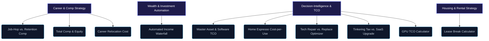

# GiniLoh Interactive Calculators & Decision Engines

This document provides a comprehensive summary of the ten interactive calculators and decision-intelligence engines implemented in the GiniLoh front end. These tools help professionals quantify career moves, asset purchases, software upgrades, and rental choices with mathematical clarity.

---

## Directory Overview by Category

---

## Category 1: Career & Compensation Strategy

### 1. Job-Hop vs. Retention Compensation Calculator
* **Slug:** `raise-velocity`
* **Route:** `/calculators/raise-velocity/`
* **Visual Accent:** Cyan
* **Status:** Live
* **Utility:** Evaluate career compensation options over a 10-year cumulative horizon.
* **Core Dilemma:** Compares staying at a current role with standard annual raises (e.g., 3%) versus strategic job-hopping every 2–3 years yielding higher bumps (e.g., 15–20%).
* **Key Inputs:**
  * Base Salary ($)
  * Standard Annual Raise (%)
  * Job-Hop Bump (%)
  * Job-Hop Frequency (Years)
* **Mathematical Logic:**
  * Projections are modeled using compound interest formulas applied over a 10-year timeline:
    * **Standard Path:** Cumulative sum of base salary inflated by standard raise percentage compounded annually.
    * **Job-Hop Path:** Cumulative sum of base salary, applying standard raises on non-hop years and the job-hop bump in hop years.
    * **Opportunity Reclaimed:** Cumulative Job-Hop earnings minus Cumulative Standard earnings.

### 2. Total Compensation & Equity Visualizer
* **Slug:** `total-comp`
* **Route:** `/calculators/total-comp/`
* **Visual Accent:** Indigo
* **Status:** Live
* **Utility:** Evaluate tech offers with vesting RSUs, options, and stock growth assumptions.
* **Core Dilemma:** Comparing tech offers with differing splits of liquid cash (base, bonus) and illiquid or volatile equity (RSUs/Options) across multiple vesting schedules.
* **Key Inputs:**
  * Base Annual Salary ($)
  * Annual Cash Bonus (%)
  * Initial Equity Grant Value ($)
  * Vesting Schedule (e.g., 4-year equal vest, 1-year cliff)
  * Stock Annual Growth Assumption (%)
* **Mathematical Logic:**
  * Computes total yearly value:
    $$\text{Yearly Total Comp} = \text{Base Salary} + \text{Cash Bonus} + \left( \frac{\text{Total Grant Shares}}{\text{Vesting Years}} \times \text{Current Stock Price} \times (1 + \text{Growth Rate})^t \right)$$
  * Factors in option strike prices to compute net options value upon vest.

### 3. Career Relocation Cost & Payback Calculator
* **Slug:** `relocation-cost`
* **Route:** `/calculators/relocation-cost/`
* **Visual Accent:** Blue
* **Status:** Live
* **Utility:** Calculate relocation payback period.
* **Core Dilemma:** Quantifying the upfront CapEx of moving (lease break fees, physical moving costs, security deposits) against the OpEx benefit of a new salary bump.
* **Key Inputs:**
  * Moving & Packing Services Cost ($)
  * New Rental Deposits ($)
  * Lease Break Penalties at Origin ($)
  * Old vs. New Monthly Salary Differential ($)
  * Tax differences (State and local tax adjustments)
* **Mathematical Logic:**
  * **Relocation CapEx:** Sum of all physical and contractual moving expenses.
  * **Monthly Payback Horizon:** 
    $$\text{Payback Period (Months)} = \frac{\text{Total Relocation CapEx}}{\text{Net Monthly Salary Increase}}$$

---

## Category 2: Wealth & Investment Automation

### 4. Automated Income Waterfall Simulator
* **Slug:** `money-flow`
* **Route:** `/calculators/money-flow/`
* **Visual Accent:** Violet
* **Status:** Live (Functional template with proposed taxonomy)
* **Utility:** Simulate and visualize automated investing flows and account routing.
* **Core Dilemma:** Designing an automated pipeline to route gross income dynamically into tax-advantaged accounts (401k, HSA, IRA) and taxable brokerages.
* **Key Inputs:**
  * Gross Monthly Income ($)
  * Retirement Matching Thresholds (%)
  * HSA Contribution Options ($)
  * Fixed Living Expenses & Buffer Rules ($)
* **Mathematical Logic:**
  * Simulates a waterfall model:
    1. **Siphon 1 (Taxes):** Calculates estimated federal/state tax draw.
    2. **Siphon 2 (Pre-Tax):** Directs income to pre-tax 401(k) up to employer matching threshold.
    3. **Siphon 3 (Health/Security):** Routes funds to HSA and Emergency Funds.
    4. **Siphon 4 (Post-Tax):** Spills remaining overflow into Backdoor Roth IRA and taxable brokerage accounts.

---

## Category 3: Decision-Intelligence & TCO Analysis

### 5. Master Asset & Software TCO Calculator
* **Slug:** `decision-intelligence`
* **Route:** `/calculators/decision-intelligence/`
* **Visual Accent:** Indigo
* **Status:** Live
* **Utility:** Aggregated multi-tab hub for build-vs-buy and personal asset total cost of ownership (TCO) analysis.
* **Core Dilemma:** Serves as a unified playground using GiniLoh's four core decision rules (Cost-per-use, Repair-vs-replace, Build-vs-buy, Tinkering tax).
* **Key Inputs / Sections:**
  * **Cost-Per-Use:** Upfront price, weekly usage, upkeep, alternative cost.
  * **Repair vs Replace:** Age of asset, repair quote, category selection (Consumer vs Major Infrastructure).
  * **Build vs Buy (SaaS):** Loaded developer rate, build time, maintenance FTE, compliance audit cost, SaaS pricing.
  * **Tinkering Tax:** Troubleshooting hours, loaded opportunity rate, platform premium.
* **Mathematical Logic:**
  * Evaluates and returns corresponding verdicts based on GiniLoh's threshold parameters (e.g., Software 5,000 Rule, Consumer 1,500 Rule, Opportunity Reclaimed Horizonal projections).

### 6. Home Espresso Cost-per-Use Calculator
* **Slug:** `coffee-arbitrage`
* **Route:** `/calculators/coffee-arbitrage/`
* **Visual Accent:** Emerald
* **Status:** Live
* **Utility:** Evaluate home espresso machine cost-per-use (CPU) amortization.
* **Core Dilemma:** Does investing in a premium home espresso setup ($600 to $4,900) offset daily cafe expenses over a multi-year horizon?
* **Key Inputs:**
  * Setup Sticker Price ($)
  * Outsource Cost (Café price per drink, e.g., $6.00)
  * Upkeep per drink (Coffee beans, milk, chemicals, e.g., $1.50)
  * Weekly Usage Frequency (Drinks/week)
  * Lifespan Horizon (Years)
* **Mathematical Logic:**
  * **Outsource TCO:** 
    $$\text{TCO}_{\text{outsource}} = \text{Uses}_{\text{lifetime}} \times \text{Cost}_{\text{cafe}}$$
  * **Home TCO:** 
    $$\text{TCO}_{\text{home}} = \text{Sticker Price} + (\text{Uses}_{\text{lifetime}} \times \text{Cost}_{\text{upkeep}}) + \text{Maintenance Fees (5% of sticker/year)}$$
  * **Home Cost-Per-Use (CPU):** 
    $$\text{CPU} = \frac{\text{TCO}_{\text{home}}}{\text{Uses}_{\text{lifetime}}}$$
  * **Verdict:** BUY if $\text{CPU} < \text{Cost}_{\text{cafe}}$, else SKIP.

### 7. Tech Repair vs. Replace Optimizer
* **Slug:** `tech-debt-repair`
* **Route:** `/calculators/tech-debt-repair/`
* **Visual Accent:** Indigo
* **Status:** Live
* **Utility:** Calculate repair-vs-replace index score for personal tech (laptops, phones).
* **Core Dilemma:** Deciding whether to repair an older electronic device with a cracked screen/dead battery or buy a new replacement model.
* **Key Inputs:**
  * Device Age (Years)
  * Immediate Repair Quote ($)
  * Category Threshold (Defaulted to `1500` for consumer electronics)
* **Mathematical Logic:**
  * **Vulnerability Index Score:**
    $$\text{Index} = \text{Device Age} \times \text{Repair Quote}$$
  * **Verdict Rule:**
    * If $\text{Index} \ge 1,500 \implies$ **REPLACE** (Outdated asset is a depreciating money pit).
    * If $\text{Index} < 1,500 \implies$ **REPAIR** (Patching is mathematically efficient).

### 8. Tinkering Tax vs. SaaS Upgrade Calculator
* **Slug:** `no-code-terminator`
* **Route:** `/calculators/no-code-terminator/`
* **Visual Accent:** Cyan
* **Status:** Live
* **Utility:** Calculate hidden tinkering tax of manual workarounds vs. centralized software premium.
* **Core Dilemma:** Quantifying whether maintaining a fragile chain of Notion databases, sheets, and Zapier connections is cheaper than paying for HubSpot CRM.
* **Key Inputs:**
  * Monthly Troubleshooting Time (Hours spent fixing broken integrations/zaps)
  * Loaded Opportunity Rate (Hourly labor value of the person troubleshooting, e.g., $75/hr)
  * Unified Platform Premium Cost (Incremental subscription increase, e.g., $450/mo)
* **Mathematical Logic:**
  * **Monthly Time Cost (Tinkering Tax):** 
    $$\text{Cost}_{\text{monthly-time}} = \text{Hours Spent} \times \text{Opportunity Rate}$$
  * **3-Year Net Savings:** 
    $$\text{Savings}_{3\text{yr}} = (\text{Cost}_{\text{monthly-time}} - \text{Platform Premium}) \times 36 \text{ months}$$
  * **Verdict:** UPGRADE if $\text{Cost}_{\text{monthly-time}} > \text{Platform Premium}$, else SKIP.

### 9. GPU TCO Calculator
* **Slug:** `gpu-compute`
* **Route:** `/calculators/gpu-compute/`
* **Visual Accent:** Violet
* **Status:** Live
* **Utility:** Compare local deep learning workstation builds vs. cloud GPU compute instances.
* **Core Dilemma:** Evaluate if buying local GPU rigs (RTX 4090s, L40S setups) beats renting cloud resources (RunPod, Lambda Labs, Paperspace) under variable compute frequencies.
* **Key Inputs:**
  * Daily GPU compute hours & days per month
  * Local GPU model selection (drives hardware CapEx, system component costs, and wattage draws)
  * Cloud GPU provider rates, egress tariffs, and persistent storage sizing
* **Mathematical Logic:**
  * **Local TCO:** Hardware CapEx + System components + 3-year electricity cost (Watts draw $\times$ electricity rate $\times$ compute hours) + hardware maintenance overhead.
  * **Cloud TCO:** (Cloud hourly rate $\times$ compute hours) + (persistent storage cost $\times$ 36 months) + egress fees.
  * **Break-Even Analysis:** Determines the exact monthly compute density threshold at which buying local hardware pays off.

---

## Category 4: Housing & Rental Strategy

### 10. Lease Break Calculator
* **Slug:** `lease-break`
* **Route:** `/calculators/lease-break/`
* **Visual Accent:** Emerald
* **Status:** Live
* **Utility:** Estimate the real financial cost of breaking a rental lease early.
* **Core Dilemma:** Deciding if paying exit penalties to break a lease makes financial sense when relocating or moving to a cheaper apartment.
* **Key Inputs:**
  * Current Monthly Rent ($)
  * Remaining Months on Lease (Months)
  * Landlord Lease Break Penalty Fee (Flat or multiple of monthly rent)
  * Notice Period Required (Months)
  * Estimated Security Deposit Forfeiture ($)
* **Mathematical Logic:**
  * **Contractual Liability Cost:** Sum of notice period rents, buyout penalties, and lost deposits.
  * **Stay TCO:** Current Rent $\times$ Remaining Months.
  * **Exit Cost comparison:** Helps renters evaluate the cost-to-leave against potential savings at a new, lower-rent destination.
