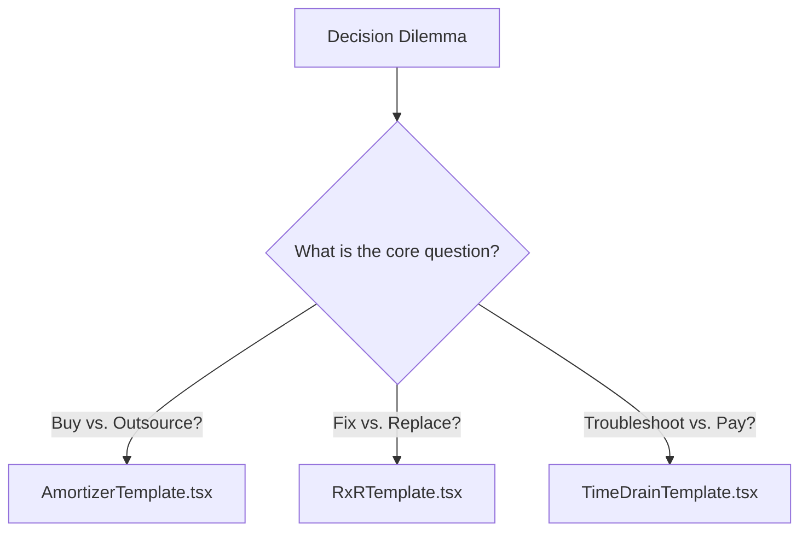

# Modular Decision-Intelligence Architecture Guide

This document explains the architecture of GiniLoh's specialized Decision-Intelligence micro-apps. It describes how the framework is structured, how the math engines run under the hood, and how to rapidly spin up new custom calculators.

---

## 🏗️ The 3 Core Template Blueprints

Rather than maintaining a single complex, monolithic interface, the system splits decision scenarios into three dedicated React components located in `src/components/calculators/react/`:



### 1. The Amortizer (`AmortizerTemplate.tsx`)
* **Use Case**: Evaluating if the upfront cost of purchasing an asset (CapEx) makes sense compared to paying transactionally for a service or outsourcing it (OpEx).
* **Math Engine**:
  * $\text{Total Uses} = \text{Weekly Usage} \times 52 \times \text{Lifespan Years}$
  * $\text{Ownership TCO} = \text{Sticker Price} + (\text{Total Uses} \times \text{Secondary Upkeep Cost}) + \text{Maintenance (5% per year)}$
  * $\text{Outsourced TCO} = \text{Total Uses} \times \text{Outsource Cost}$
  * $\text{Break-Even Uses} = \frac{\text{Sticker Price} + \text{Maintenance}}{\text{Outsource Cost} - \text{Secondary Upkeep Cost}}$
* **Examples**: Espresso Machine Arbitrage, Home Gym Truth Meter, Dedicated AI GPU Rig.

### 2. The Life Horizon Toggle (`RxRTemplate.tsx`)
* **Use Case**: Deciding whether to repair a failing or aging physical/digital asset or replace it with a modern equivalent.
* **Math Engine**:
  * $\text{Asset Debt Index} = \text{Asset Age} \times \text{Immediate Repair Quote}$
  * If $\text{Asset Debt Index} \ge \text{Threshold}$, recommend **REPLACE**; otherwise, recommend **REPAIR**.
  * **Standard Thresholds**:
    * Consumer Electronics: `1,500`
    * Vehicles, HVAC, Real Estate, Enterprise Software: `5,000`
* **Examples**: Tech Repair vs. Replace Optimizer, Lemon Car Indicator, Legacy Codebase Migrator.

### 3. The Time-Drain Audit (`TimeDrainTemplate.tsx`)
* **Use Case**: Evaluating if paying a recurring subscription for specialized software/services is worth it to avoid wasting hours troubleshooting manual workarounds (the "Tinkering Tax").
* **Math Engine**:
  * $\text{Monthly Time Cost} = \text{Wasted Hours} \times \text{Opportunity Hourly Value}$
  * $\text{3-Year Net Savings} = (\text{Monthly Time Cost} \times 36) - (\text{Subscription Cost} \times 36)$
* **Examples**: Personal Life Tracker, Smart Home Plug Stabilizer, Tinkering Tax vs. SaaS Upgrade Calculator.

---

## 🚀 How to Add a New Use Case

Adding a new micro-app requires zero modifications to React component code. You simply feed a custom configuration object into one of the templates.

### Step 1: Create the Astro Page
Create a new file in `src/pages/calculators/your-use-case.astro`.

```astro
---
import CalculatorShell from '../../components/calculators/CalculatorShell.astro';
import AmortizerTemplate from '../../components/calculators/react/AmortizerTemplate';
import BaseLayout from '../../layouts/BaseLayout.astro';

const config = {
  title: 'Your Custom Calculator',
  description: 'Enter a compelling subtitle explaining the decision trade-offs.',
  eyebrow: 'Asset Arbitrage', // Or 'Asset Horizon / RxR', 'Time & Focus Audit'

  // Input Field Labels & Tooltips
  stickerLabel: 'Sticker Price',
  stickerHelp: 'Help text explaining what goes into the upfront price.',
  stickerDefault: 1000,

  frequencyLabel: 'Usage Frequency',
  frequencyHelp: 'Help text explaining the usage density.',
  frequencyUnit: 'runs / wk',
  frequencyDefault: 5,

  outsourceLabel: 'Outsourced Rate',
  outsourceHelp: 'Help text explaining the outsourcing/transactional cost.',
  outsourceDefault: 15,

  secondaryLabel: 'Upkeep Cost',
  secondaryHelp: 'Help text explaining secondary costs (materials, power, etc.).',
  secondaryDefault: 2,

  lifespanLabel: 'Expected Lifespan',
  lifespanHelp: 'Years of usage target.',
  lifespanDefault: 3,

  // Verdict Custom Text
  buyVerdictTitle: 'Proceed with Purchase',
  buyVerdictSubtitle: 'Ownership is mathematically superior and saves capital over time.',
  skipVerdictTitle: 'Continue Outsourcing',
  skipVerdictSubtitle: 'Your usage density is too low to justify the upfront CapEx.'
};
---

<BaseLayout title={`${config.title} | Gini Loh`}>
  <CalculatorShell eyebrow={config.eyebrow} title={config.title} description={config.description}>
    <div slot="calculator">
      <AmortizerTemplate client:load config={config} />
    </div>
    
    <div slot="aside">
      <!-- Add specific FAQs or Guides for this use case here -->
    </div>
  </CalculatorShell>
</BaseLayout>
```

### Step 2: Register in metadata.ts
Add your new calculator metadata to the list in `src/lib/calculators/metadata.ts`. This registers the slug and automatically lists it in the site directory:

```typescript
{
  title: 'Your Custom Calculator',
  slug: 'your-use-case',
  href: '/calculators/your-use-case/',
  status: 'Live',
  accent: 'emerald', // emerald, indigo, cyan, blue, violet
  description: 'A brief 2-sentence description showing on the index page.',
  utility: 'Short metric description',
  category: 'FinanceApplication',
  keywords: ['key1', 'key2']
}
```

---

## 🎨 Best Practices for Styling & UX
* **No Sliders**: Keep interactive controls limited to clean number/currency inputs and step counter buttons (`+` / `−`) to ensure high contrast and zero frustration.
* **Keep High Contrast**: Make sure that custom rationales and warning boxes use clear color cues (Emerald/Green for Buy, Blue/Cyan for Wait, Red/Rose for Replace) to align with GiniLoh's glassmorphic visual system.
